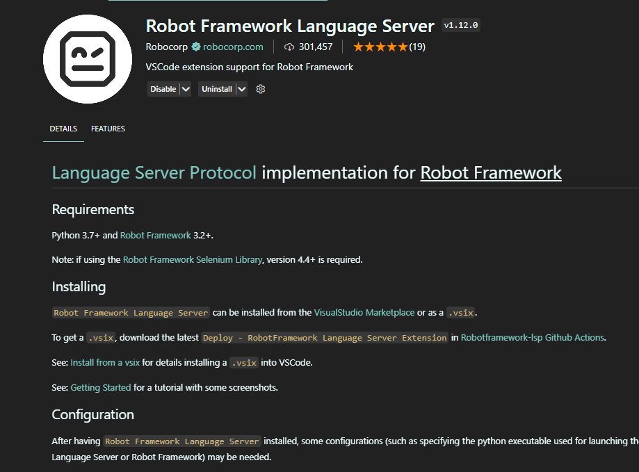
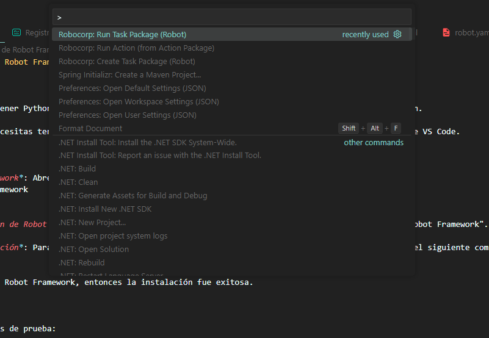
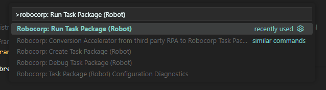
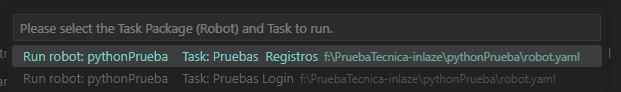
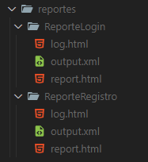

# Guía de Instalación de Robot Framework en VS Code con Python

## Requisitos Previos

1. *Python*: Necesitas tener Python instalado en tu sistema. Puedes descargarlo desde la página oficial de Python.

2. *VS Code*: También necesitas tener instalado Visual Studio Code. Puedes descargarlo desde la página oficial de VS Code.

## Pasos de Instalación

1. *Instalar la extension*: abre las extensiones de visual estudio code y instala la extension Robot Framework Language Server:
    

2. *Instalar la extensión de Robocorp Code*: Abre VS Code, ve al apartado de extensiones y busca "Robocorp Code". Instala la extensión que aparece.

## Ejecucion de los test

  Para ejecutar los casos de prueba:
  
  1. ejecutar el comando Control+Shift+P
    
  2. buscar el siguiente comando: robocorp: Run Task Package (Robot)
    
  3. Selecionar una de las task deseadas:
    
  4. Una vez terminadas las pruebas se vera el reporte en la carpeta reportes de la task seleccionada
    
